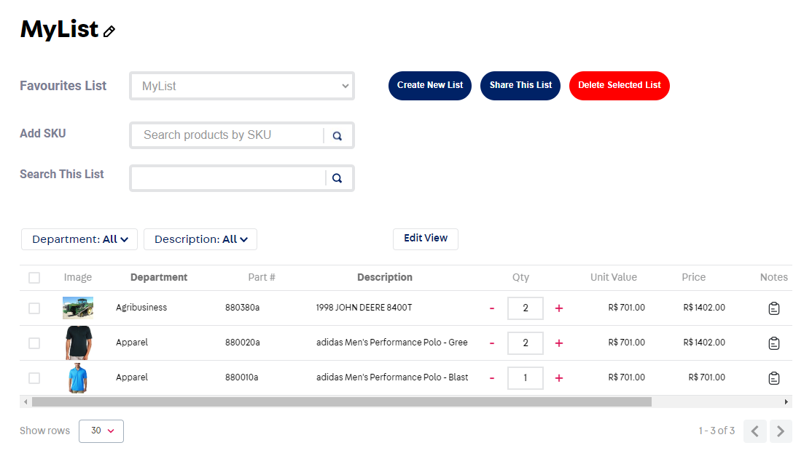

📢 Use this project, [contribute](https://github.com/clouda-inc/wish-list-v2) to it or open issues to help evolve it using [Store Discussion](https://github.com/vtex-apps/store-discussion).

# My Wishlists

<!-- DOCS-IGNORE:start -->
<!-- ALL-CONTRIBUTORS-BADGE:START - Do not remove or modify this section -->
[](#contributors-)
<!-- ALL-CONTRIBUTORS-BADGE:END -->
<!-- DOCS-IGNORE:end -->

The **My Wishlists** app handles the favorite products of users. Users can create multiple lists and add the products they like to those lists. They can manage them and Add them to the cart and buy.



## Configuration

To configure the My Wishlists app, check the sections below.

### Adding the My Wishlists app to your theme's dependencies

In your theme's `manifest.json`, add the Search Result app as a dependency:

```json
"dependencies": {
    "alfonsob2b.my-wishlists": "1.x"
}
```

Now, you can use all the blocks exported by the `search-result` app. Check out the full list below:

Next, add the **props table** containing your block's props. 

If the app exports more than one block, create several tables - one for each block. For example:

### `block-1` props

| Prop name    | Type            | Description    | Default value                                                                                                                               |
| ------------ | --------------- | --------------------------------------------------------------------------------------------------------------------------------------------- | ---------- | 
| `XXXXX`      | `XXXXXX`       | XXXXXXXX         | `XXXXXX`        |


### `block-2` props

| Prop name    | Type            | Description    | Default value                                                                                                                               |
| ------------ | --------------- | --------------------------------------------------------------------------------------------------------------------------------------------- | ---------- | 
| `XXXXX`      | `XXXXXX`       | XXXXXXXX         | `XXXXXX`        |

Prop types are: 

- `string` 
- `enum` 
- `number` 
- `boolean` 
- `object` 
- `array` 

When documenting a prop whose type is `object` or `array` another prop table will be needed. You can create it following the example below:

- `propName` object:

| Prop name    | Type            | Description    | Default value                                                                                                                               |
| ------------ | --------------- | --------------------------------------------------------------------------------------------------------------------------------------------- | ---------- | 
| `XXXXX`      | `XXXXXX`       | XXXXXXXX         | `XXXXXX`        |


Remember to also use this Configuration section to  **showcase any necessary disclaimer** related to the app and its blocks, such as the different behavior it may display during its configuration. 


## Customization

In order to apply CSS customizations in this and other blocks, follow the instructions given in the recipe on [Using CSS Handles for store customization](https://vtex.io/docs/recipes/style/using-css-handles-for-store-customization).


| CSS Handles |
| ----------- | 
| `notesContainer` | 
| `addNotesIcons` | 
| `notesButtonContainer` | 
| `notesSubmitButtonContainer` | 
| `notesSubmitButton` |
| `notesSubmitDisabledButton` |
| `notesModalContainer` |
| `notesModalTitle` |
| `notesModalBottomRow` |
| `notesCancelButton` |
| `productSummary` |
| `productSummaryImageContainer` |
| `productSummaryImage` |
| `productSummaryInfo` |
| `productSummaryInfoName` |
| `productSummaryInfoDetails` |
| `productSummaryInfoDetailsPartNumber` |
| `productSummaryInfoDetailsPrice` |
| `noteSubTitle` |
| `autocompleteInputWrapper` |
| `productPriceContainer` |
| `unitPriceContainer` |
| `wishlistNameContainer` |
| `buttonWishlistName` |
| `titleWishlistName` |
| `wishlistName` |
| `wishlistSearchContainer` |
| `wishlistProductTexts` |
| `wishlistSelector` |
| `wishlistSearchSKUContainer` |
| `wishlistPrivacyOptionsContainer` |
| `componentContainer` |
| `componentContainerHelper` |
| `addSkuContainer` |
| `textContainer` |
| `textContainerTitle` |
| `textContainerDescription` |
| `wishlistOptionTexts` |
| `wishlistCreationOptions` |
| `wishlistCreateNew` |
| `wishlistDelete` |
| `wishlistAddItem` |
| `wishlistRemoveItem` |
| `wishlistDeleteWishList` |
| `wishlistDeleteItem` |
| `wishlistCreateNewHelper` |
| `wishlistSearchSKU` |
| `wishlistSelectListOne` |
| `wishlistSelectListOneOption` |
| `wishlistSelectListOneText` |
| `MyWishListsPage` |
| `containerLinkShare` |
| `popupCopy` |
| `privacySettings` |
| `createListandAndSelectFav` |
| `nameAndOptionsMobile` |
| `optionsMobile` |


<!-- DOCS-IGNORE:start -->

## Contributors ✨

Thanks goes to these wonderful people:

<!-- ALL-CONTRIBUTORS-LIST:START - Do not remove or modify this section -->
<!-- prettier-ignore-start -->
<!-- markdownlint-disable -->
<!-- markdownlint-enable -->
<!-- prettier-ignore-end -->
<!-- ALL-CONTRIBUTORS-LIST:END -->

This project follows the [all-contributors](https://github.com/all-contributors/all-contributors) specification. Contributions of any kind are welcome!

<!-- DOCS-IGNORE:end -->

---- 

Check out some documentation models that are already live: 
- [Breadcrumb](https://github.com/vtex-apps/breadcrumb)
- [Image](https://vtex.io/docs/components/general/vtex.store-components/image)
- [Condition Layout](https://vtex.io/docs/components/all/vtex.condition-layout@1.1.6/)
- [Add To Cart Button](https://vtex.io/docs/components/content-blocks/vtex.add-to-cart-button@0.9.0/)
- [Store Form](https://vtex.io/docs/components/all/vtex.store-form@0.3.4/)
